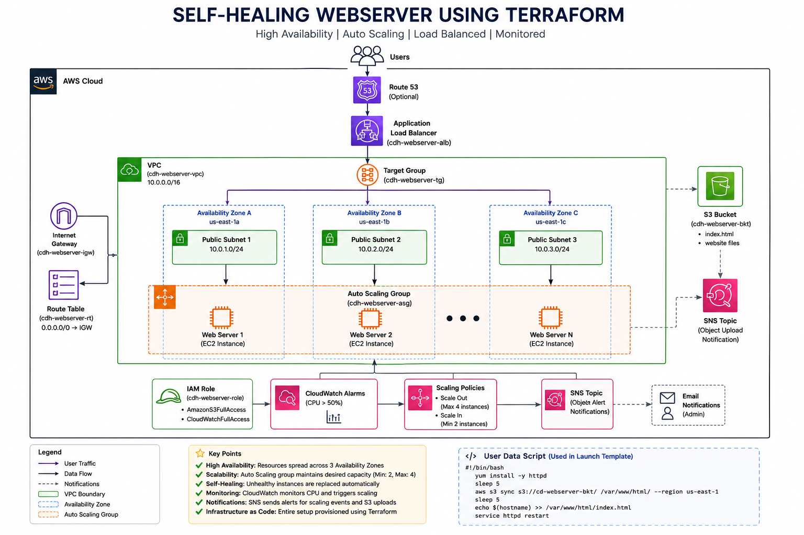

# 🚀 Self-Healing Web Server using Terraform

A production-style **Infrastructure as Code (IaC)** project that provisions a **highly available**, **load-balanced**, and **self-healing** web server infrastructure on AWS using **Terraform**.

The infrastructure automatically replaces unhealthy EC2 instances, distributes traffic through an Application Load Balancer, monitors CPU utilization using CloudWatch, and sends notifications through SNS.

---

## 📌 Project Overview

This project demonstrates how to deploy a resilient web application infrastructure using Terraform on AWS.

The architecture consists of:

- Amazon VPC
- 3 Public Subnets (Multi-AZ)
- Internet Gateway
- Route Table
- Security Group
- IAM Role
- S3 Bucket
- EC2 Launch Template
- Auto Scaling Group
- Application Load Balancer
- Target Group
- CloudWatch
- SNS Notifications

The website files are stored in an S3 bucket and automatically synchronized to EC2 instances during startup using a User Data script.

---

# 📖 Architecture

> Add your architecture image here.

```
docs/
└── architecture.png
```

```md

```

---

# ✨ Features

- Infrastructure as Code using Terraform
- Multi-AZ High Availability
- Self-Healing Infrastructure
- Auto Scaling
- Application Load Balancer
- Static Website hosted from S3
- Automatic Website Deployment
- CloudWatch Monitoring
- SNS Email Notifications
- Modular Terraform Structure
- Git Version Control

---

# 🏗️ Architecture Flow

```
                User
                  │
                  ▼
      Application Load Balancer
                  │
          Target Group
                  │
        Auto Scaling Group
        ┌─────────┴─────────┐
        │                   │
    EC2 Instance       EC2 Instance
        │                   │
        └─────────┬─────────┘
                  │
             Apache HTTPD
                  │
                  ▼
           Website Files
                  ▲
                  │
             S3 Bucket
                  │
      Object Upload Notification
                  ▼
                 SNS

CloudWatch
      │
      ▼
Scaling Policy
      │
      ▼
Auto Scaling Group
```

---

# ☁️ AWS Services Used

| Service | Purpose |
|----------|----------|
| VPC | Network Isolation |
| Public Subnets | EC2 Deployment |
| Internet Gateway | Internet Access |
| Route Table | Routing |
| Security Group | Firewall Rules |
| IAM Role | EC2 Permissions |
| EC2 | Apache Web Server |
| Launch Template | Instance Configuration |
| Auto Scaling Group | Self-Healing |
| Target Group | ALB Backend |
| Application Load Balancer | Traffic Distribution |
| S3 | Website Storage |
| CloudWatch | Monitoring |
| SNS | Notifications |
| Terraform | Infrastructure as Code |

---

# 📂 Project Structure

```
self-healing-webserver/
│
├── modules/
│   ├── vpc/
│   ├── iam/
│   ├── security_group/
│   ├── s3/
│   ├── launch_template/
│   ├── target_group/
│   ├── alb/
│   ├── autoscaling/
│   ├── cloudwatch/
│   └── sns/
│
├── userdata/
│   └── install.sh
│
├── website/
│   └── index.html
│
├── docs/
│   └── architecture.png
│
├── providers.tf
├── versions.tf
├── variables.tf
├── terraform.tfvars
├── outputs.tf
├── main.tf
├── README.md
└── .gitignore
```

---

# 🛠️ Technologies Used

- Terraform
- AWS
- Git
- GitHub
- Linux
- Apache HTTP Server

AWS Services

- EC2
- VPC
- ALB
- Auto Scaling
- IAM
- S3
- CloudWatch
- SNS

---

# ⚙️ Prerequisites

- AWS Account
- IAM User with Administrator Access
- AWS CLI Installed
- Terraform >= 1.5
- Git
- GitHub Account

---

# 📥 Clone Repository

```bash
git clone https://github.com/<your-username>/self-healing-webserver.git

cd self-healing-webserver
```

---

# 🔑 Configure AWS CLI

```bash
aws configure
```

Enter

```
AWS Access Key
AWS Secret Key
Region
Output Format
```

---

# 🚀 Terraform Workflow

Initialize Terraform

```bash
terraform init
```

Format Code

```bash
terraform fmt
```

Validate Configuration

```bash
terraform validate
```

Review Execution Plan

```bash
terraform plan
```

Deploy Infrastructure

```bash
terraform apply
```

Destroy Infrastructure

```bash
terraform destroy
```

---

# 🌐 Infrastructure Components

## Networking

- VPC
- Internet Gateway
- Route Table
- 3 Public Subnets

---

## Security

- Security Group
- IAM Role
- IAM Instance Profile

---

## Storage

- S3 Bucket
- Website Files
- Bucket Policy

---

## Compute

- Launch Template
- EC2 Instances
- Apache Web Server

---

## Load Balancing

- Application Load Balancer
- Target Group

---

## High Availability

- Auto Scaling Group
- Minimum Capacity: 2
- Desired Capacity: 2
- Maximum Capacity: 4

---

## Monitoring

- CloudWatch Alarm

CPU Utilization > 50%

---

## Notifications

SNS

- Scaling Notifications
- Object Upload Notifications

---

# 🔄 Self-Healing Workflow

```
User Request
      │
      ▼
Application Load Balancer
      │
      ▼
Target Group
      │
      ▼
Healthy EC2 Instance
      │
      ▼
Apache HTTP Server
      │
      ▼
Website

If an EC2 instance becomes unhealthy:

CloudWatch
      │
      ▼
Auto Scaling detects failure
      │
      ▼
Terminate Unhealthy Instance
      │
      ▼
Launch New EC2 Instance
      │
      ▼
Run User Data Script
      │
      ▼
Sync Website from S3
      │
      ▼
Instance becomes Healthy
```

---

# 📈 Auto Scaling Configuration

| Setting | Value |
|----------|-------|
| Minimum Capacity | 2 |
| Desired Capacity | 2 |
| Maximum Capacity | 4 |
| Scale Out | CPU > 50% |
| Scale In | CPU Normal |

---

# 🧪 Testing

- Verify website accessibility through ALB DNS.
- Upload a new `index.html` to the S3 bucket and confirm EC2 instances synchronize the content.
- Terminate an EC2 instance and verify the Auto Scaling Group launches a replacement.
- Increase CPU utilization to trigger the CloudWatch alarm and confirm scaling actions.
- Confirm SNS email notifications for scaling events and S3 object uploads.

---

# 📸 Project Screenshots

```
docs/
├── architecture.png
├── terraform-apply.png
├── alb.png
├── autoscaling.png
├── cloudwatch.png
├── sns-email.png
└── website.png
```

---

# 🎯 Learning Outcomes

- Infrastructure as Code
- AWS Networking
- High Availability
- Auto Scaling
- Load Balancing
- IAM
- Cloud Monitoring
- Event-driven Notifications
- Terraform Modules
- Git Version Control

---

# 🚀 Future Improvements

- Terraform Remote Backend (S3 + DynamoDB)
- Route 53 Domain
- HTTPS using ACM
- GitHub Actions CI/CD
- Docker Support
- Kubernetes Deployment
- Terraform Workspaces
- AWS Systems Manager Session Manager
- WAF Integration

---

# 👨‍💻 Author

**Chaitanya Daphal**

- LinkedIn: https://linkedin.com/in/<your-profile>
- GitHub: https://github.com/<your-username>

---

# ⭐ If you found this project useful

Give this repository a ⭐ on GitHub.